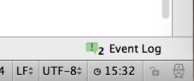

Introduction
===========

Ever wonder what time it is? Now [IntelliJ] can tell you.

Building the plugin
===================

Prerequisites
-------------
To develop on the plugin you'll need IntelliJ (14).

Make sure the following plugins are enabled:

 * Plugin DevKit
 * Grammar-Kit

Read the [Guidelines for plugin development] for info on writing a plugin.

Building
--------

Run `./gradlew idea` to generate the module and project files.

Before opening the project in IntelliJ, make sure you've created a IDEA SDK configuration:

   File -> Project Structure...

Goto `JDKs` and add (`+`) a IntelliJ Platform Plugin SDK. Point it to `lib/sdk/idea-IC-139.1603.1`.

Now you can open the project, build it and run it as a Plugin.

Of course you can also build the plugin with Gradle: `./gradlew dist`. The plugin zip file is located in `build/distributions`. From there you can install it in your IDE.

License
=======

This plugin is licensed under [Apache License, V2.0].

[IntelliJ]: http://www.jetbrains.com/idea/
[Guidelines for plugin development]: https://www.jetbrains.com/idea/help/plugin-development-guidelines.html
[Apache License, V2.0]: http://www.apache.org/licenses/LICENSE-2.0
